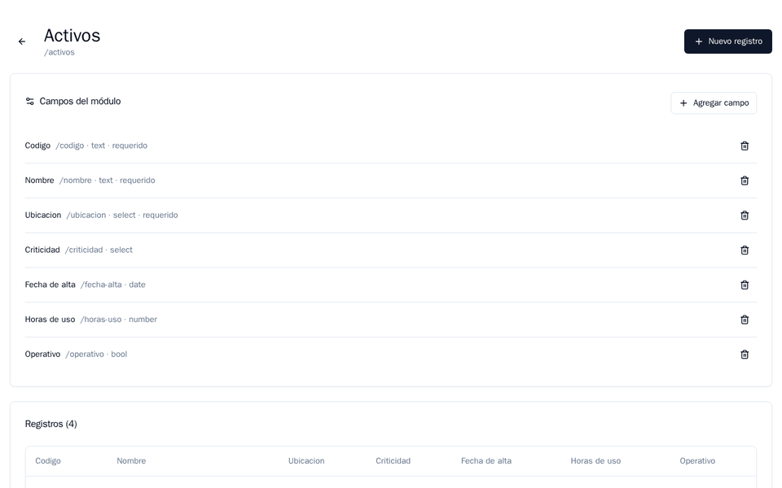

# KUIDY-CORE

*[Léeme en español](README.es.md)*

**Define a field and the form is already there.**

A platform for building internal apps without writing code, in the spirit of a light Odoo: you create projects, modules and fields from the interface, and a generic engine renders the form and the list, validates what you type and stores it.



## Try it

**https://kuidy-core-demo-164532276262.us-central1.run.app**

Sign in as `owner@kuidy.demo`, open the **Activos** module, hit **Agregar campo** (add field) and then **Nuevo registro** (new record). That is the whole product in half a minute. The interface is in Spanish.

One account per permission level, all with the password `Demo1234!`:

| Account | Role | Can |
|---|---|---|
| `owner@kuidy.demo` | Owner | Everything, including members |
| `admin@kuidy.demo` | Admin | Create and change modules and fields |
| `member@kuidy.demo` | Member | Create and edit records |
| `viewer@kuidy.demo` | Viewer | Read only |

It ships with two sample projects: *Operaciones*, with assets, work orders and the warehouse of a made-up plant, and *Soporte*, with tickets and customers. Every record in there is fictional and anyone can change it. It runs on Google Cloud Run and scales to zero, so the first load after a while takes a few seconds.

## Why it exists

Every company asks for the same system with a different form: other fields, other rules, other screen. Coding that form once per client is work that never adds up. KUIDY-CORE stores the **definition** of each module and lets the engine do the rest, so what adds up is the platform.

## How it works

- **Definition and data live apart.** Projects, modules and fields are plain PostgreSQL tables. Records go into a single table with a `jsonb` column and its GIN index, so adding a field never touches the database schema.
- **The validator is built at runtime.** A module's field definitions are turned into a Zod schema, and that same schema is built in the browser, to warn while you type, and in the API, which is the one that decides.
- **The form and the list are generated from that definition**: every field type brings its own control and its own column.
- **Access is per project.** Passwords hashed with argon2id, sessions as a seven-day JWT, and four roles — owner, admin, member, viewer — checked on every route. Someone who cannot write gets the "no" from the server, not from the interface.
- **The field designer lives in a side drawer**: fields are created, edited, reordered and deleted without leaving the data, with a type picker and an options editor for dropdowns.

## Field types

`text` · `number` · `date` · `datetime` · `bool` · `select`

Each with its validation — numbers must be finite, dates must look like dates, a dropdown only accepts its own options — and its control in the form.

## Stack

pnpm monorepo, strict TypeScript.

- **API:** Hono, Drizzle ORM, PostgreSQL, Zod, argon2id
- **Web:** React 19, Vite
- **Shared:** the types and the schema builder

## Run it locally

Node 20 or newer, pnpm 9 or newer, and Docker.

```bash
cp .env.example .env                      # DATABASE_URL and JWT_SECRET are required
pnpm install
pnpm db:up                                # PostgreSQL in a container
pnpm --filter @kuidy/shared build         # the rest of the monorepo imports its dist
pnpm --filter @kuidy/api db:migrate       # migrations
pnpm dev                                  # API and web at once
```

The Docker image builds the whole monorepo and leaves the compiled web next to the API, so a single container serves both from the same origin. Deployment: [docs/DESPLIEGUE-CLOUD-RUN.md](docs/DESPLIEGUE-CLOUD-RUN.md).

## Scope, honestly

What is here is finished and hand-tested; what is missing is missing entirely.

- **No relations between modules** yet: fields hold values, not references.
- **A field's type cannot be changed** once created, and its key cannot be renamed. Deciding what happens to the data already stored comes first, and that is next in line.
- **No search, filters or reports**; the list paginates and sorts.
- **Saved views** (`form`, `list`, with their own row and column layout) live in the data model and the API, validated server-side, but the interface does not expose them yet, so the demo does not show them.
- **No automated tests and no CI.** First debt on the list.

## Roadmap

1. Schema evolution: change a field's type with data inside, reporting what converts and what does not.
2. Relations between modules.
3. Invite members and change roles from the interface.
4. Search and filters over the data.
5. Tests for the schema engine, and CI.
